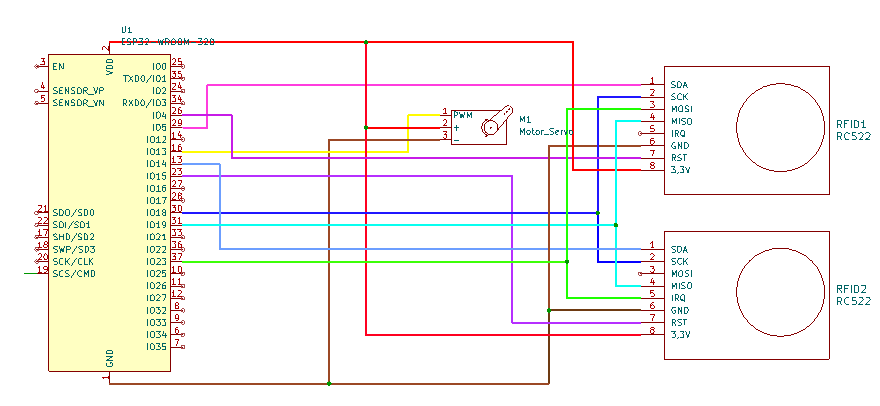
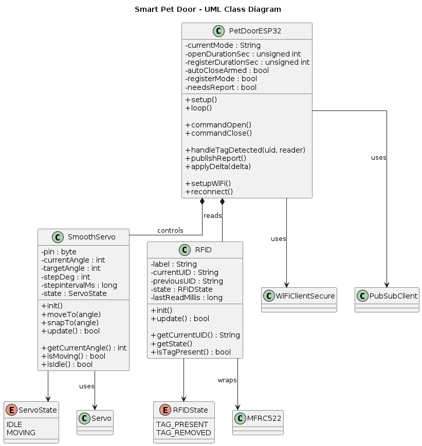
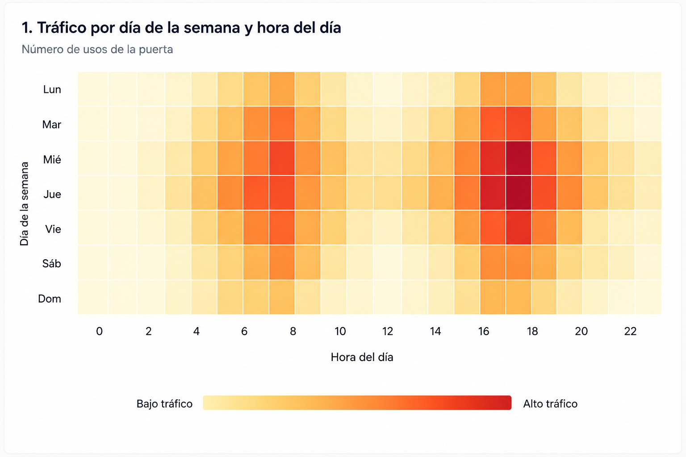
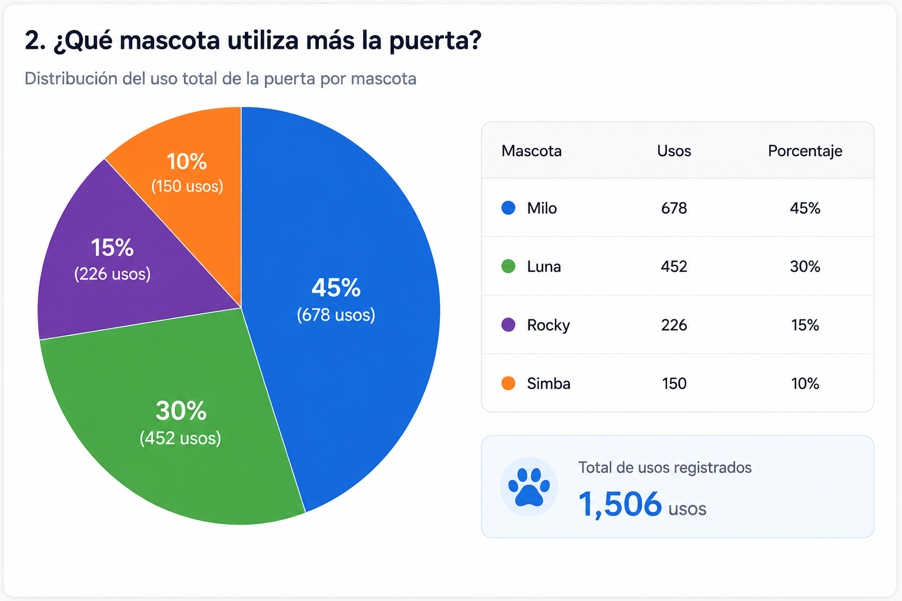
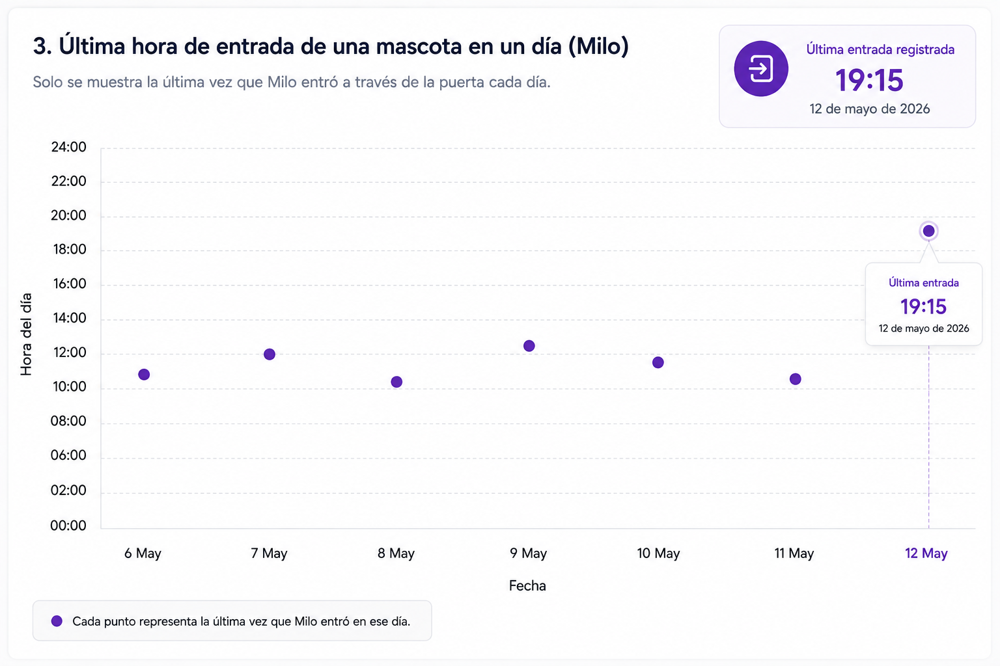
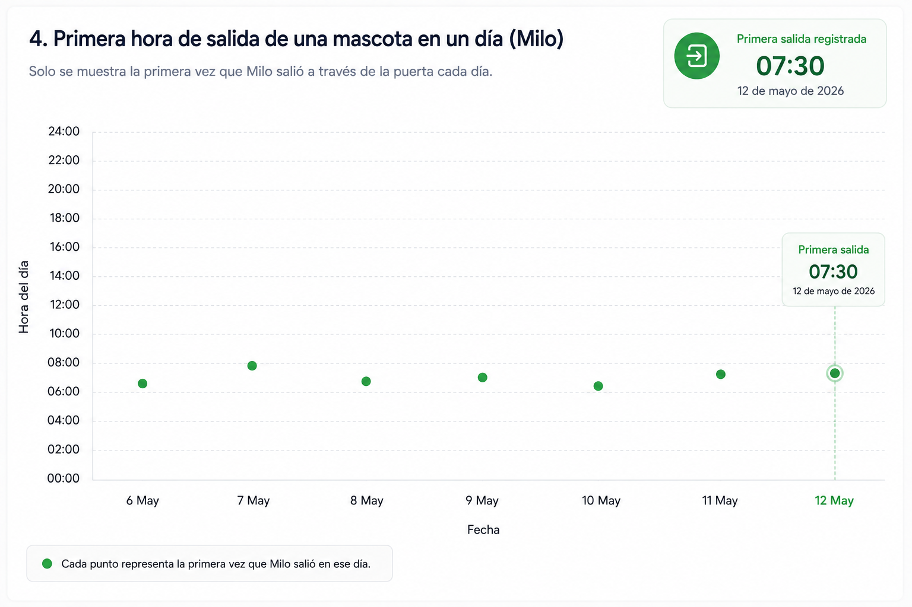
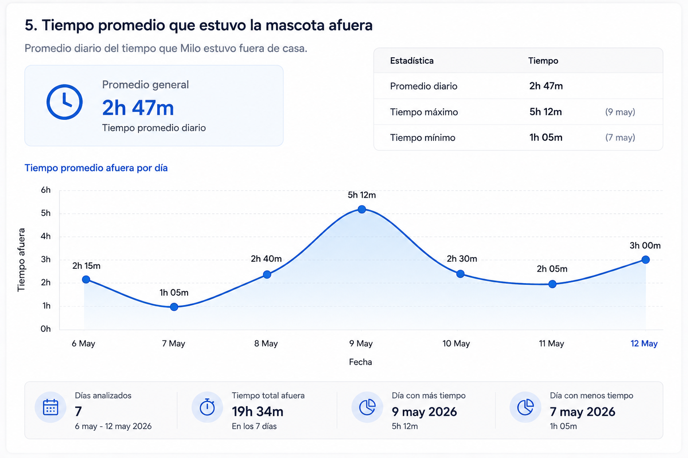
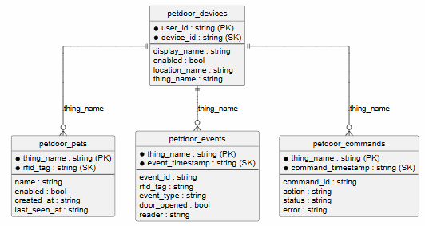

# Universidad Católica Boliviana Cochabamba
## Departamento de Ingeniería y Ciencias Exactas
## [SIS-234] Internet De Las Cosas
### Carrera de Ingeniería de Sistemas

---

# Informe sobre:
## Integración de un objeto inteligente con Alexa mediante MQTT y AWS.

### Evaluación de la Materia Internet de las Cosas

**Autores:**

- Vargas Prado Ariana Nicole  
- Zubieta Sempertegui Andres Ignacio  

---

Cochabamba - Bolivia  
Mayo 2026 

# 1. Requerimientos Funcionales y No Funcionales
## Requerimientos Funcionales

- El sistema debe permitir la lectura de tarjetas mediante dos sensores RFID-RC522 uno de entrada y otro de salida. 
- El sistema debe identificar y diferenciar cada tarjeta RFID registrada.
- El sistema debe enviar el ID de la tarjeta leída hacia AWS IoT Core mediante MQTT.
- El sistema debe actualizar el estado reportado del dispositivo en el Shadow de AWS IoT Core.
- El sistema debe recibir comandos desde AWS IoT Core a través del Device Shadow desde Alexa y IoT core, los comandos se dividen en: 
    #### Comandos de acción del sistema:
   - Abrir puerta (SetModeOpen)
   - Cerrar puerta (SetModeClose)
   - Automatizar la puerta (SedModeAuto)
   - Cambiar temporizador de puerta (SetAutoTimer)
   - Registrar un RFID autorizado (AddNewTag)
   - Quitar un RFID registrado (RemoveTag) 
   -  Registar el ultimo Tag percibido (RegisterLastTagIntent)
    #### Comandos para recibir informacióm del sistema: 
   - Obtener estado del motor (GetMotorState) 
   - Obtener el tiempo de la ultima vez que se abrió la puerta (GetLastOpenTime) 
   - Obtener el ultimo tag registrado (GetLastTag) 
   - Obtener el estado de la puerta (GetDoorState)
   - Conformar el registro del ultimo Tag (ConfirmTagRegistrationIntent)
- El sistema debe controlar el servomotor MG90S en función de los comandos anteriormente mencionados. 
- El sistema debe permitir el movimiento del servomotor cuando una tarjeta autorizada sea detectada.
- El sistema debe negar el acceso cuando una tarjeta no autorizada sea detectada.
El sistema debe permitir el control del servomotor mediante comandos a través de Alexa.
El sistema debe permitir que Alexa registre y mande las siguientes categorías:
   - Estado de la puerta: si está abierta o cerrada
   - Estado del motor: si está en movimiento o si está parado 
   - Información del sensor: si percibió algo, en qué momento percibió la mascota, que mascota percibió
   - nombre de la mascota
- El sistema debe guardar datos en una Base de Datos (DynamoDB) cuando los sensores detecten un Tag.
- El sistema debe guardar datos en DynamoDB las veces que se envio un comando de apertura, al Shadow del Objeto Inteligente.

## Requerimientos No Funcionales

- El sistema debe garantizar una comunicación segura con AWS IoT Core (uso de certificados y TLS).
- El sistema debe tener una latencia de respuesta menor a 5 segundos entre comando y acción.
- El sistema debe ser escalable para integrar más sensores o actuadores en el futuro.
- El sistema debe ser modular, permitiendo separar lógica de hardware, red y control.
- El sistema debe manejar errores de conexión (reintentos automáticos a AWS).
- El sistema debe ser compatible con redes WiFi estándar (802.11 b/g/n).
- El sistema debe registrar logs básicos para depuración y monitoreo.
- El sistema debe ser fácil de usar mediante comandos simples en Alexa.


# 2. Diseño del Sistema

## 2.1 Diagrama de circuito

## 2.2 Diagrama de arquitectura del sistema

## 2.3 Diagramas estructurales y de comportamiento
### 2.3.1 Diagrama de secuencia

### 2.3.2 Diagrama UML


### 2.4 Diseño de la skill de Alexa 

#### Nombre de la Skill

**Smart_Pet_Door**

#### Invocation Name

**Puerta Inteligente**

#### Tabla de Intents

| Intent | Función | Slot | Ejemplo de comando |
|----------|----------|----------|-------------------|
| ConnectToDoorIntent | Conectar una puerta según ubicación | `location` | "Conectar con la puerta de entrada" |
| SetModeAutoIntent | Activar modo automático | No tiene | "Activa modo automático" |
| SetModeClosedIntent | Cerrar y bloquear la puerta | No tiene | "Cerrar la puerta" |
| SetModeOpenIntent | Abrir la puerta | No tiene | "Abrir la puerta" |
| AddNewTagIntent | Iniciar registro de una mascota | `petName` | "Registrar mascota llamada Luna" |
| ConfirmTagRegistrationIntent | Confirmar registro después de acercar el tag | No tiene | "Confirmar registro" |
| RegisterLastTagIntent | Registrar directamente el último tag detectado | `petName` | "Registrar último tag como Rocky" |
| RemoveTagIntent | Eliminar una mascota | `petName` | "Eliminar mascota Luna" |
| SetAutoTimerIntent | Configurar tiempo de apertura | `openTime` | "Timer de apertura 30 segundos" |
| SetRegisterDurationIntent | Configurar duración de registro | `registerTime` | "Tiempo de registro 5 segundos" |
| GetDoorStateIntent | Consultar estado de la puerta | No tiene | "¿La puerta está abierta?" |
| GetMotorStateIntent | Consultar estado del motor | No tiene | "¿Cómo está el motor?" |
| GetLastTagIntent | Consultar la última detección RFID | No tiene | "¿Cuál fue el último tag?" |
| GetLastOpenTimeIntent | Consultar última apertura | No tiene | "¿Cuándo se abrió la puerta?" |
| GetListOfPetsIntent | Mostrar mascotas registradas | No tiene | "Listar mascotas" |

#### Flujo de conversación

##### Apertura de puerta

```text
Usuario
    ↓
"Abre la puerta"

Alexa Skill
    ↓
SetModeOpenIntent
    ↓
AWS Lambda procesa la solicitud
    ↓
Actualización del Device Shadow en AWS IoT Core
    ↓
ESP32 recibe el comando
    ↓
Servo acciona la apertura
    ↓
Alexa responde:

"La puerta fue abierta."
```

##### Registro de una mascota

```text
Usuario
    ↓
"Registrar mascota Oliver"

Alexa Skill
    ↓
AddNewTagIntent
    ↓
AWS Lambda activa modo registro
    ↓
Actualización del Device Shadow
    ↓
ESP32 entra en modo registro
    ↓
Alexa responde:

"Modo de registro activado.
Acerca el tag y di confirmar registro"

Usuario
    ↓
Acerca el RFID
    ↓
"Confirmar registro"

Alexa Skill
    ↓
ConfirmTagRegistrationIntent
    ↓
Lee el último tag detectado
    ↓
Guarda información en DynamoDB
    ↓
Alexa responde:

"Oliver fue registrado correctamente."
```
##### Registro de una mascota

```text
Usuario
    ↓
"Registra a Oliver "

Alexa Skill
    ↓
AddNewTagIntent
    ↓
AWS Lambda activa modo registro
    ↓
Actualización del Device Shadow
    ↓
ESP32 entra en modo registro
    ↓
RFID detecta etiqueta
    ↓
Información almacenada en DynamoDB
    ↓
Alexa responde:

"Oliver fue registrado correctamente."
```
### 2.5 Diseño de reportes (mockups) con información relevante para la toma de decisiones

#### 1. Tráfico de uso de la puerta por día de la semana y hora del día


#### 2. Distribución de uso de la puerta por mascota


#### 3. Última hora de entrada registrada por día para una mascota


#### 4. Primera hora de salida registrada por día para una mascota


#### 5. Tiempo promedio que la mascota permaneció fuera de casa


### 2.6 Diseño Modelo de Datos 


# 3. Implementación

## 3.1 Código fuente documentado

[Enlace a GitHub] https://github.com/Andrezubi/Practica4-IoT-PetDoor

## 3.2 Configuraciones en Alexa (Skill e Interaction Model)

# Configuraciones en Alexa (Skill e Interaction Model)

1. Ingresar a **Alexa Developer Console**.

2. Crear una nueva Skill.

3. Configurar los parámetros iniciales:

   - Nombre de la Skill: `SmartPetDoor`
   - Locale: `Spanish (US)`
   - Tipo de experiencia: `Other`
   - Modelo: `Custom`
   - Hosting Service: `Provision your own`
   - Template: `Start From Scratch`

4. Definir el **nombre de invocación** de la Skill:

   puerta inteligente

5. Crear todos los **Intents** definidos previamente en el diseño de la Skill, junto con sus respectivos **slots** y **utterances**.

   Consideraciones:

   - Para valores numéricos se utilizó el slot:
   
     AMAZON.FOUR_DIGIT_NUMBER
    
   - Para entradas de texto se utilizó:

     AMAZON.SearchQuery

   - Se agregaron suficientes utterances para mejorar el reconocimiento de lenguaje natural.

6. Ir al menú **Endpoint**.

7. Copiar el **Skill ID** generado automáticamente.

8. Ir a la función **AWS Lambda** que funcionará como backend.

9. Agregar un **trigger de tipo Alexa Skill**.

10. Pegar el **Skill ID** copiado anteriormente.

11. Desde la función Lambda copiar el **ARN (Amazon Resource Name)**.

12. Volver a la configuración de **Alexa Endpoint**.

13. Pegar el ARN en la opción:

   Default Region

14. Guardar los cambios.

15. Presionar:

   Build Model

16. Esperar a que finalice la compilación y verificar que no existan errores.

## 3.3 Configuraciones en AWS (IoT Core, Rules, Lambda y DynamoDB)

## 3.3 Configuraciones en AWS (IoT Core, Rules, Lambda y DynamoDB)

### Configuraciones en AWS IoT Core

#### Configuración del Thing

- Ingresar a **AWS Console**
- Entrar a **IoT Core**
- Ir al menú **Devices**
- Seleccionar **Things**
- Presionar **Create Things**
- Escoger **Create single thing**
- Definir el nombre del Thing:

```text
Thing Name: pet_door_esp32
```

- En **Device Shadow** escoger:

```text
Classic Shadow
```

- Definir un Shadow inicial con la siguiente estructura:

```json
{
  "state": {
    "desired": {
      "config": {
        "mode": "auto",
        "open_duration_sec": 15,
        "register_duration_sec": 20
      },
      "door_command": {
        "action": "open",
        "request_id": "cmd-6cb7f4e2"
      }
    },
    "reported": {
      "config": {
        "mode": "auto",
        "open_duration_sec": 15,
        "register_duration_sec": 20
      },
      "door": {
        "state": "closed",
        "motor_state": "idle",
        "last_opened_at": "2026-05-12T01:15:40Z",
        "last_command_id": "cmd-184"
      },
      "last_event": {
        "reader": "exit",
        "tag": "24:9F:2A:57",
        "detected_at": "2026-05-24T19:37:05Z",
        "event_id": "5d53afa2-c109-49d1-9a2c-e4d787ae70d8"
      }
    }
  }
}
```

- Escoger:

```text
Auto-generate a new certificate
```

---

### Configuración de Policy

- Ir a **Policies**
- Presionar **Create Policy**
- Definir:

```text
Policy Name: pet_door_esp32_Policy
```

- Crear las siguientes reglas:

| Policy Effect | Policy Action | Policy Resource |
|---------------|---------------|-----------------|
| Allow | iot:Publish | * |
| Allow | iot:Subscribe | * |
| Allow | iot:Connect | * |
| Allow | iot:Receive | * |

- Seleccionar la Policy creada previamente
- Presionar **Create Thing**

---

### Descarga de certificados

Una vez creado el Thing, AWS permitirá descargar automáticamente los certificados necesarios para establecer una comunicación segura entre el ESP32 y AWS IoT Core.

Descargar los siguientes archivos:

```text
Amazon Root CA 1
Private Key File
Device Certificate
```

Posteriormente se debe copiar el contenido de los certificados dentro del código principal del ESP32 en las variables correspondientes:

```cpp
const char AMAZON_ROOT_CA1[] PROGMEM = R"EOF(
...
)EOF";

const char CERTIFICATE[] PROGMEM = R"KEY(
...
)KEY";

const char PRIVATE_KEY[] PROGMEM = R"KEY(
...
)KEY";
```

Estos certificados permiten implementar autenticación mediante TLS y asegurar la comunicación MQTT entre el dispositivo y AWS IoT Core.

## 3.3 Configuraciones en AWS (IoT Core, Rules, Lambda y DynamoDB)

### Configuraciones en AWS IoT Core

#### Configuración del Thing

- Ingresar a **AWS Console**
- Entrar a **AWS IoT Core**
- Ir al menú **Devices**
- Seleccionar **Things**
- Presionar **Create Things**
- Escoger **Create single thing**
- Definir el nombre del Thing:

```text
Thing Name: pet_door_esp32
```

- En **Device Shadow** seleccionar:

```text
Classic Shadow
```

- Definir el Shadow inicial con la siguiente estructura:

```json
{
  "state": {
    "desired": {
      "config": {
        "mode": "auto",
        "open_duration_sec": 15,
        "register_duration_sec": 20
      },
      "door_command": {
        "action": "open",
        "request_id": "cmd-6cb7f4e2"
      }
    },
    "reported": {
      "config": {
        "mode": "auto",
        "open_duration_sec": 15,
        "register_duration_sec": 20
      },
      "door": {
        "state": "closed",
        "motor_state": "idle",
        "last_opened_at": "2026-05-12T01:15:40Z",
        "last_command_id": "cmd-184"
      },
      "last_event": {
        "reader": "exit",
        "tag": "24:9F:2A:57",
        "detected_at": "2026-05-24T19:37:05Z",
        "event_id": "5d53afa2-c109-49d1-9a2c-e4d787ae70d8"
      }
    }
  }
}
```

- Escoger:

```text
Auto-generate a new certificate
```

---

### Configuración de Policies

- Ir a **Policies**
- Presionar **Create Policy**
- Definir:

```text
Policy Name: pet_door_esp32_Policy
```

- Agregar las siguientes reglas:

| Policy Effect | Policy Action | Policy Resource |
|---------------|---------------|-----------------|
| Allow | iot:Publish | * |
| Allow | iot:Subscribe | * |
| Allow | iot:Connect | * |
| Allow | iot:Receive | * |

- Seleccionar la Policy creada previamente
- Presionar **Create Thing**

---

### Descarga de certificados

Una vez creado el Thing, AWS generará automáticamente los certificados necesarios para establecer comunicación segura mediante MQTT y TLS.

Descargar los siguientes archivos:

```text
Amazon Root CA 1
Private Key File
Device Certificate
```

Copiar posteriormente el contenido de los certificados dentro del código principal del ESP32:

```cpp
const char AMAZON_ROOT_CA1[] PROGMEM = R"EOF(
...
)EOF";

const char CERTIFICATE[] PROGMEM = R"KEY(
...
)KEY";

const char PRIVATE_KEY[] PROGMEM = R"KEY(
...
)KEY";
```

---

## Configuración de funciones Lambda

Las siguientes configuraciones deben realizarse para ambas funciones Lambda:

- Backend de Alexa
- Lógica de procesamiento de eventos del Rule

### Creación de la función

- Ir a **AWS Lambda**
- Presionar **Create Function**
- Definir:

```text
Runtime: Python 3.14
```

- Definir el nombre correspondiente:

```text
petdoor_alexa_backend
petdoor_iot_rule_logic
```

- Presionar **Create Function**

- Subir el código fuente correspondiente.

Para la función Lambda del backend de Alexa también debe cargarse el paquete comprimido de despliegue:

```text
deployment.zip
```

(Archivo presente dentro del repositorio del proyecto).

---

### Configuración de Trigger

Presionar **Add Trigger**

Seleccionar el tipo de origen correspondiente.

#### Trigger para Lambda de lógica IoT

Seleccionar:

```text
Source: AWS IoT
```

Configurar:

```text
Rule Type: Custom IoT Rule
Existing Rule: [Regla creada previamente]
```

Presionar:

```text
Add
```

---

#### Trigger para Lambda del backend Alexa

Seleccionar:

```text
Source: Alexa
```

Configurar:

```text
Skill ID Verification: Enable
Skill ID: [ID de la Skill]
```

Presionar:

```text
Add
```

---

### Configuración de permisos IAM

- Ir a **AWS IAM**
- Entrar al menú **Roles**
- Seleccionar el rol generado automáticamente para la función Lambda
- Presionar **Add permissions**
- Seleccionar **Attach Policies**

Agregar las siguientes políticas:

| Política |
|-----------|
| AmazonDynamoDBFullAccess |
| AWSIoTFullAccess |

Presionar:

```text
Add permissions
```

- Volver a Lambda
- Presionar:

```text
Deploy
```

---

## Configuración de IoT Rule

- Entrar a **AWS IoT Core**
- Ir al menú **Message Routing**
- Seleccionar **Rules**
- Presionar **Create Rule**

Definir:

```text
Rule Name: petdoor_event_rule
```

Definir el SQL Statement:

```sql
SELECT
    topic(3) AS thing_name,

    current.state.reported.last_event.event_id AS event_id,

    current.state.reported.last_event.reader AS reader,

    current.state.reported.last_event.tag AS tag,

    current.state.reported.last_event.detected_at AS detected_at,

    current.state.reported.config.mode AS mode,

    current.state.reported.door.state AS door_state,

    timestamp() AS aws_timestamp

FROM '$aws/things/+/shadow/update/documents'

WHERE
    startswith(topic(3), 'pet_door')
    AND current.state.reported.last_event.event_id <>
        previous.state.reported.last_event.event_id
```

---

### Configuración del Rule Action

- Presionar **Add Rule Action**
- Seleccionar:

```text
Action Type: Lambda
```

- Escoger la función Lambda creada previamente

```text
petdoor_iot_rule_logic
```

- Presionar:

```text
Create Rule
```


# 4. Pruebas y Validaciones

## 4.1 Prueba de exactitud de distancia

Para evaluar la exactitud del sensor RFID-RC522 se realizaron 16 mediciones de distancia máxima de detección, acercando lentamente la tarjeta RFID hasta identificar el punto límite en el que el sensor lograba reconocerla correctamente.

Los resultados obtenidos muestran que el sensor mantiene una distancia de detección estable y consistente, con valores que oscilan principalmente entre 3.2 cm y 3.7 cm. Se registró un único valor atípico de 6.5 cm, el cual se considera una medición aislada probablemente ocasionada por variaciones en la orientación de la tarjeta o interferencias externas.

A partir de los datos registrados se obtuvo:

- Distancia promedio de detección: **3.68 cm**
- Distancia mínima registrada: **3.2 cm**
- Distancia máxima registrada: **6.5 cm**
- Rango frecuente de funcionamiento: **3.3 cm a 3.7 cm** 

## 4.2 Prueba de interferencia según distintos materiales

Para analizar el comportamiento del sensor RFID-RC522 frente a distintos materiales, se realizaron pruebas colocando diferentes superficies entre la tarjeta RFID y el sensor, manteniendo una distancia aproximada de entre 1 cm y 3 cm.

Los materiales utilizados fueron:

- Cartón de 1.2 cm de grosor.
- Plastoformo de 1.4 cm de grosor.
- Vidrio de 0.5 cm de grosor.
- Madera de 1.5 cm de grosor.
- Tela de 3.4 cm de grosor.
- Plástico de 3.3 cm de grosor.
- Aluminio de 0.5 cm de grosor.

Durante las pruebas se realizaron 10 mediciones por material para determinar si el sensor lograba detectar correctamente la tarjeta y si existía reducción en la distancia útil de lectura.

Resultados obtenidos:

- **Cartón:** detección exitosa en el 100% de las pruebas, sin reducción apreciable de distancia.
- **Plastoformo:** detección exitosa en el 100% de las pruebas, aunque se observó una disminución moderada de la distancia útil.
- **Vidrio:** detección exitosa en el 100% de las pruebas, pero con interferencia considerable en la estabilidad de lectura.
- **Madera:** detección exitosa en el 100% de las pruebas, con ligera reducción de distancia.
- **Tela:** detección exitosa en el 100% de las pruebas, sin efectos relevantes.
- **Plástico:** detección exitosa en el 100% de las pruebas, sin efectos significativos.
- **Aluminio:** el sensor no logró detectar la tarjeta en ninguna prueba, presentando además fallos temporales de lectura posteriores a la interferencia.

Los resultados muestran que los materiales no metálicos afectan mínimamente el funcionamiento del sensor, mientras que el aluminio genera una interferencia total debido a las propiedades electromagnéticas del material.

## 4.3 Prueba de tiempo de respuesta del sensor

Para evaluar el tiempo de respuesta del sensor RFID-RC522 se realizaron mediciones relacionadas con:

- Tiempo de reconocimiento de la tarjeta.
- Tiempo que tarda el sensor en dejar de detectar la tarjeta luego de alejarla.

Durante las pruebas se observó que el tiempo de lectura fue prácticamente instantáneo, por lo que no pudo medirse manualmente con precisión utilizando cronómetro.

En cambio, sí se logró medir el tiempo de “olvido” del sensor, obteniéndose los siguientes resultados:

- Tiempo promedio de olvido: **1.57 segundos**
- Tiempo mínimo registrado: **1.33 segundos**
- Tiempo máximo registrado: **1.86 segundos**
- Desviación estándar: **0.14 segundos**

Estos resultados muestran que el sensor posee una detección rápida y estable, manteniendo temporalmente el último estado detectado antes de reiniciarse.

## 4.4 Prueba de lectura continua

Se realizó una prueba de funcionamiento continuo dejando una tarjeta RFID sobre el sensor durante periodos prolongados de tiempo para verificar si existían pérdidas de conexión o fallos de lectura.

Las pruebas se realizaron desde 1 minuto hasta 10 minutos continuos.

Resultados obtenidos:

- El sensor mantuvo la detección activa durante todo el tiempo de prueba.
- No se presentaron pérdidas de conectividad.
- No se detectaron reinicios ni desconexiones del sistema.
- La estabilidad fue del 100% durante los 10 minutos evaluados.

## 4.5 Prueba de interferencia entre tarjetas

Se realizó una prueba utilizando dos tarjetas RFID simultáneamente con el objetivo de determinar el comportamiento del sensor al detectar múltiples identificadores cercanos.

Resultados obtenidos:

- El sensor logró detectar ambas tarjetas.
- El sistema alternaba continuamente entre los IDs detectados.
- El cambio de identificación ocurría de forma rápida y constante mientras ambas tarjetas permanecían cerca del sensor.
- Cuando las tarjetas fueron colocadas perpendicularmente al sensor, ninguna pudo ser detectada.

Esto demuestra que el sensor RFID-RC522 no está diseñado para manejar múltiples tarjetas simultáneamente en espacios reducidos, ya que se producen conflictos de lectura.

## 4.6 Pruebas de tiempo de reacción del servomotor

Se realizaron pruebas para medir el tiempo requerido por el servomotor MG90S para realizar movimientos de 90°.

Se ejecutaron 10 mediciones consecutivas obteniendo los siguientes resultados:

- Tiempo promedio de giro de 90°: **1754.6 ms**
- Tiempo mínimo registrado: **1746 ms**
- Tiempo máximo registrado: **1759 ms**

Los resultados muestran que el servomotor presenta un comportamiento estable y consistente en todos los movimientos realizados.

## 4.7 Prueba de precisión del servomotor

Para evaluar la precisión del servomotor se realizaron mediciones físicas de posición en ángulos de 0° y 180°.

Resultados obtenidos:

### Medición en 0°

- Promedio: **1.02**
- Desviación estándar: **0.079**

### Medición en 180°

- Promedio: **1.18**
- Desviación estándar: **0.063**

Los resultados muestran una baja variación entre mediciones, indicando que el servomotor mantiene una posición estable y repetible.

## 4.8 Prueba de funcionamiento continuo del servomotor

Se realizó una prueba de funcionamiento continuo del servomotor durante periodos prolongados para evaluar posibles problemas de calentamiento o pérdida de velocidad.

Resultados obtenidos:

- El servomotor funcionó correctamente durante los 9 minutos de prueba.
- No se detectó calentamiento significativo.
- No se observó disminución de velocidad.
- El sistema mantuvo estabilidad mecánica durante toda la prueba.

## 4.9 Prueba de obstrucciones del servomotor

Se realizaron pruebas colocando distintos objetos como obstrucción física al movimiento del servomotor.

Materiales utilizados:

- Dedos
- Madera
- Plastoformo
- Vidrio
- Metal
- Cartón

Resultados obtenidos:

- El servomotor logró recuperar rápidamente su posición después de la mayoría de interferencias.
- Las obstrucciones más rígidas, como metal y vidrio, lograron detener temporalmente el movimiento.
- Materiales ligeros como cartón y plastoformo no impidieron el funcionamiento normal del motor.

Esto demuestra que el sistema posee una capacidad aceptable de recuperación ante pequeñas obstrucciones mecánicas.

# 4.10 Prueba de velocidad de respuesta del sistema

Se realizó una prueba para medir el tiempo de respuesta total del sistema desde que se ejecuta un comando mediante Alexa hasta que el servomotor realiza la acción correspondiente.

Para esta prueba se enviaron múltiples comandos de apertura y cierre de puerta utilizando Alexa, registrando el tiempo requerido para que el sistema procese el comando mediante AWS IoT Core y MQTT hasta activar el servomotor.

Resultados obtenidos:

- Tiempo promedio de respuesta: **3.44 segundos**
- Tiempo mínimo registrado: **2.95 segundos**
- Tiempo máximo registrado: **4.10 segundos** 

# 4.11 Prueba de flujo completo de autenticación RFID

Se realizó una prueba para validar el funcionamiento completo del flujo de autenticación RFID, verificando la detección de tarjetas, el envío de información mediante MQTT, la actualización del Device Shadow, la apertura de la puerta y el almacenamiento de eventos en la base de datos.

Durante la prueba se utilizaron tarjetas autorizadas y no autorizadas tanto en el sensor de entrada como en el sensor de salida.

Observación importante:

- Solo las tarjetas 1 y 2 se encontraban registradas dentro del sistema.

Resultados obtenidos:

- Detección correcta de RFID: **100%**
- Envío correcto mediante MQTT: **100%**
- Apertura correcta con tarjetas autorizadas: **100%**
- Bloqueo de tarjetas no autorizadas: **100%**
- Registro exitoso en base de datos: **100%**

# 4.12 Prueba de comandos de Alexa y sincronización con AWS

Se realizó una prueba para verificar el funcionamiento de los comandos enviados desde Alexa y su sincronización con AWS IoT Core, el Device Shadow, el servomotor y la base de datos.

Durante las pruebas se evaluaron comandos relacionados con:

- Apertura y cierre de puerta.
- Automatización del sistema.
- Configuración de temporizador.
- Registro y eliminación de etiquetas RFID.
- Consultas de estado e información del sistema.

En cada comando se verificó:

- Reconocimiento correcto por Alexa.
- Actualización del Device Shadow.
- Movimiento del servomotor.
- Registro de información en la base de datos.

Resultados observados durante las pruebas:

- Los comandos **AbrirPuerta** y **CerrarPuerta** lograron modificar correctamente el Device Shadow y activar el movimiento del servomotor.
- Los comandos **AutomatizarPuerta**, **CambiarTemporizador** e **IniciarRegistroRFID** lograron modificar el Device Shadow, pero no ejecutaron movimientos físicos ni almacenaron información en la base de datos.
- Los comandos **QuitarUnRFID** y **RegistrarUltimoRFID** lograron modificar el Device Shadow y almacenar información correctamente en la base de datos.
- Los comandos de consulta como **ObtenerEstadoPuerta**, **ObtenerEstadoMotor**, **ObtenerUltimaAperturaPuerta** y **ObtenerUltimoTag** fueron reconocidos por Alexa, pero no lograron modificar el Device Shadow, mover el motor ni generar registros.
- El comando **ConfirmarRegistroTag** logró almacenar correctamente información en la base de datos, aunque no produjo cambios físicos en el sistema.

Resultados obtenidos:

- Reconocimiento correcto de comandos por Alexa: **100%**
- Actualización correcta del Device Shadow: **75%**
- Movimiento correcto del servomotor: **16.7%**
- Registro exitoso en base de datos: **25%**

# 5. Resultados

## 5.1 Resultados de integración del sistema distribuido

El sistema implementado logró integrar correctamente los módulos ESP32, el sensor RFID-RC522, el servomotor MG90S, AWS IoT Core, MQTT y Alexa mediante comunicación WiFi.

Se verificó el correcto funcionamiento de:

- Lectura de tarjetas RFID.
- Envío de información mediante MQTT hacia AWS IoT Core.
- Actualización del Device Shadow.
- Recepción de comandos desde Alexa.
- Control remoto y automático del servomotor.

El sistema respondió correctamente a los comandos de apertura, cierre y automatización de la "puerta", demostrando una integración funcional entre hardware, nube y asistentes virtuales.

## 5.2 Resultados de exactitud de distancia

Los resultados muestran que el sensor RFID-RC522 posee una distancia de lectura efectiva promedio de aproximadamente **3.68 cm**, manteniendo un comportamiento estable en la mayoría de pruebas realizadas.

La mayoría de mediciones se concentraron entre **3.3 cm y 3.7 cm**, lo que evidencia un funcionamiento consistente y preciso para aplicaciones de acceso cercano.

Esto cumple correctamente con el requerimiento funcional relacionado con la lectura de tarjetas RFID.

## 5.3 Resultados de interferencia según materiales

Las pruebas realizadas demostraron que los materiales no metálicos afectan mínimamente el funcionamiento del sensor RFID.

Materiales como cartón, tela y plástico mantuvieron una tasa de detección del 100%, mientras que el aluminio bloqueó completamente la comunicación RFID debido a sus propiedades conductoras.

Esto permitió identificar las limitaciones físicas del sistema y definir recomendaciones para futuras instalaciones.

## 5.4 Resultados de tiempo de respuesta del sensor

El sensor RFID-RC522 presentó tiempos de lectura prácticamente instantáneos cuando la tarjeta se encontraba dentro del rango operativo.

El tiempo promedio para dejar de detectar una tarjeta fue de aproximadamente **1.57 segundos**, mostrando una respuesta estable y repetible.

La baja desviación estándar obtenida evidencia consistencia en el comportamiento del sensor.

## 5.5 Resultados de lectura continua

Durante las pruebas de lectura continua el sistema mantuvo estabilidad total durante periodos de hasta 10 minutos sin presentar pérdidas de detección ni desconexiones.

Esto demuestra que el sistema puede operar de manera continua y confiable durante largos periodos de funcionamiento.

## 5.6 Resultados de interferencia entre tarjetas

Las pruebas demostraron que el sensor puede detectar múltiples tarjetas cercanas, aunque no de forma simultánea estable.

Cuando dos tarjetas se encontraban próximas al sensor, el sistema alternaba constantemente entre ambos identificadores, generando inestabilidad en la lectura.

Además, la orientación de las tarjetas influye significativamente en la detección.

## 5.7 Resultados de tiempo de reacción del servomotor

El servomotor MG90S presentó tiempos de reacción consistentes, con un promedio de **1754.6 ms** para movimientos de 90°.

La baja variación entre pruebas demuestra estabilidad mecánica y precisión en los movimientos ejecutados.

## 5.8 Resultados de precisión del servomotor

Las pruebas de precisión evidenciaron una variación mínima entre posiciones repetidas, obteniendo desviaciones estándar menores a 0.08 en todas las mediciones realizadas.

Esto demuestra que el servomotor mantiene posiciones estables y repetibles, adecuadas para el sistema de apertura de puerta implementado.

## 5.9 Resultados de funcionamiento continuo del servomotor

El servomotor funcionó correctamente durante periodos prolongados sin presentar sobrecalentamiento ni pérdida de velocidad.

El sistema mantuvo estabilidad mecánica y eléctrica durante toda la prueba continua realizada.

## 5.10 Resultados de pruebas de obstrucción del servomotor

El servomotor logró recuperarse correctamente ante la mayoría de obstrucciones mecánicas evaluadas.

Los materiales más rígidos consiguieron detener temporalmente el motor, mientras que materiales ligeros no afectaron significativamente el movimiento.

Esto demuestra una adecuada capacidad de recuperación del sistema ante pequeñas interferencias físicas.

# 5.11 Resultados de prueba de velocidad de respuesta

Los resultados obtenidos muestran que el sistema mantiene tiempos de respuesta estables y adecuados para aplicaciones IoT en tiempo real.

El sistema presentó un tiempo promedio de respuesta de **3.44 segundos**, manteniéndose dentro del límite establecido de 5 segundos definido en los requerimientos no funcionales.

La mayoría de respuestas se mantuvieron entre **3 y 4 segundos**, demostrando estabilidad en la comunicación entre Alexa, AWS IoT Core, MQTT y el ESP32.

# 5.12 Resultados de flujo completo de autenticación RFID

Las pruebas demostraron que el sistema diferencia correctamente entre tarjetas autorizadas y no autorizadas.

Las tarjetas registradas lograron:

- Actualizar correctamente el Device Shadow.
- Activar la apertura de la puerta.
- Registrar eventos en la base de datos.

Por otro lado, las tarjetas no registradas fueron detectadas por el sistema, pero no lograron abrir la puerta ni modificar el estado del sistema, garantizando un control de acceso seguro.

# 5.13 Resultados de comandos de Alexa y sincronización con AWS

Los resultados muestran que el sistema logró integrar correctamente Alexa con AWS IoT Core para el control remoto de la puerta y la gestión de tarjetas RFID.

Las pruebas evidenciaron que los comandos principales de control físico, como apertura y cierre de puerta, funcionaron correctamente tanto a nivel de software como de hardware, logrando sincronizar el Device Shadow y activar el servomotor.

Asimismo, los comandos relacionados con la gestión de RFID demostraron que el sistema puede almacenar y modificar información en la base de datos correctamente.

Sin embargo, los comandos orientados a consultas de estado todavía presentan limitaciones, ya que no generan respuestas completas ni actualizaciones visibles dentro del sistema, indicando funcionalidades pendientes de implementación.

A pesar de ello, Alexa logró reconocer correctamente todos los comandos enviados durante las pruebas, demostrando estabilidad en el reconocimiento de voz y en la comunicación con AWS IoT Core mediante MQTT.

# 6. Conclusiones

1. El sistema logró integrar exitosamente el sensor RFID-RC522, el servomotor MG90S, AWS IoT Core, MQTT y Alexa, permitiendo controlar la apertura y cierre de la puerta tanto de manera automática como mediante comandos de voz. Esto demuestra el correcto funcionamiento de la arquitectura IoT implementada.

2. Las pruebas de exactitud mostraron que el sensor RFID-RC522 posee una distancia efectiva promedio de lectura de **3.68 cm**, manteniendo la mayoría de mediciones entre **3.3 cm y 3.7 cm**, lo que evidencia un comportamiento estable y adecuado para aplicaciones de control de acceso de corto alcance.

3. El sensor presentó tiempos de respuesta muy rápidos, ya que la detección de tarjetas fue prácticamente inmediata dentro del rango operativo. Además, el tiempo promedio de “olvido” registrado fue de **1.57 segundos**, con una desviación estándar de apenas **0.14 segundos**, indicando consistencia en el funcionamiento.

4. Las pruebas de interferencia demostraron que materiales no metálicos como cartón, tela y plástico permiten una detección correcta en el **100% de las pruebas realizadas**, mientras que el aluminio bloqueó completamente la comunicación RFID, evidenciando la sensibilidad del sistema frente a materiales conductores.

5. El servomotor MG90S mostró un comportamiento estable y preciso, obteniendo un tiempo promedio de **1754.6 ms** para movimientos de 90°, además de mantener funcionamiento continuo durante varios minutos sin sobrecalentamiento ni pérdida de velocidad, confirmando su confiabilidad para aplicaciones automatizadas.

6. La integración entre Alexa, AWS IoT Core, MQTT y el ESP32 permitió obtener tiempos de respuesta eficientes y consistentes. El sistema logró ejecutar acciones físicas en el servomotor en un promedio de **3.44 segundos**, cumpliendo satisfactoriamente el requerimiento no funcional de mantener una latencia menor a 5 segundos.

7. El sistema logró validar correctamente las tarjetas RFID autorizadas y bloquear aquellas que no se encontraban registradas. Además, el flujo completo de comunicación entre sensores, MQTT, AWS IoT Core y la base de datos funcionó correctamente durante todas las pruebas realizadas.

8. El sistema logró integrar exitosamente Alexa con AWS IoT Core para el control remoto de la puerta y la gestión de tarjetas RFID. Los comandos principales de apertura y cierre funcionaron correctamente, mientras que algunos comandos informativos y de automatización todavía requieren mejoras para ampliar las funcionalidades del sistema.

# 7. Recomendaciones

1. Evitar el uso de materiales metálicos, especialmente aluminio, cerca del sensor RFID-RC522, ya que durante las pruebas este material provocó una tasa de detección del **0%** y generó interferencias temporales en el funcionamiento del sistema.

2. Implementar mecanismos de filtrado o validación de lectura para evitar conflictos cuando múltiples tarjetas RFID se encuentren cerca del sensor, debido a que el sistema alterna rápidamente entre identificadores y genera lecturas inestables.

3. Incorporar una fuente de alimentación externa y regulada para el servomotor MG90S en futuras versiones del proyecto, con el objetivo de garantizar mayor estabilidad eléctrica y reducir posibles caídas de tensión durante movimientos continuos.

4. Añadir sensores complementarios, como sensores ultrasónicos o infrarrojos, para mejorar la automatización del sistema y aumentar la seguridad en la detección de presencia o movimiento cerca de la puerta.

5. Realizar pruebas de funcionamiento continuo durante periodos más prolongados y bajo distintas condiciones ambientales, con el fin de evaluar el comportamiento del sistema frente a variaciones de temperatura, humedad y uso intensivo a largo plazo.

# 8. Anexos 

[Enlace a la planilla de pruebas](https://docs.google.com/spreadsheets/d/1vf-1s-AhRqPHOushzfqOPbe9ObheVhk6w0d8jkjzZqQ/edit?gid=0#gid=0) 

### Imagenes de las pruebas


