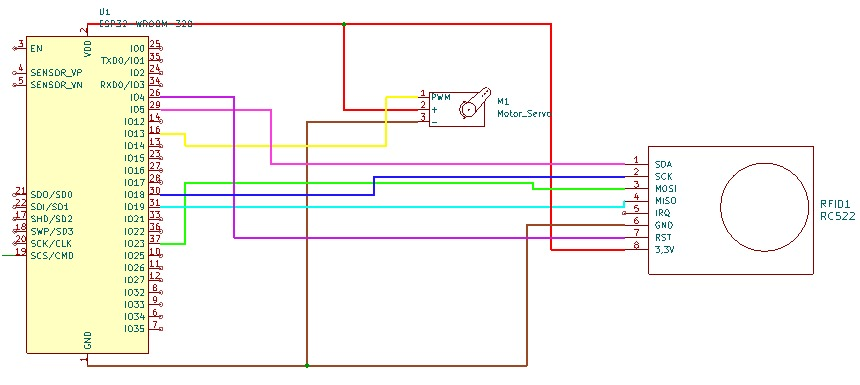
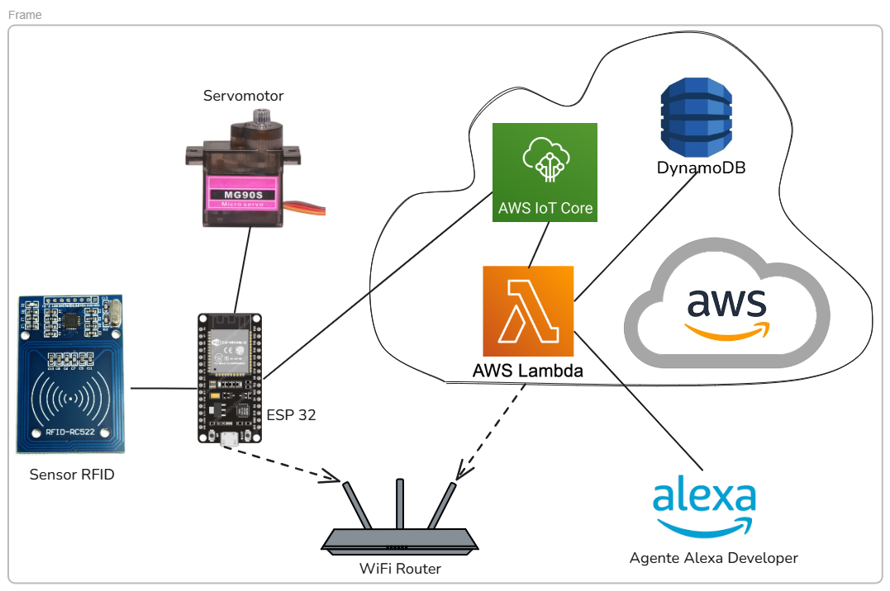
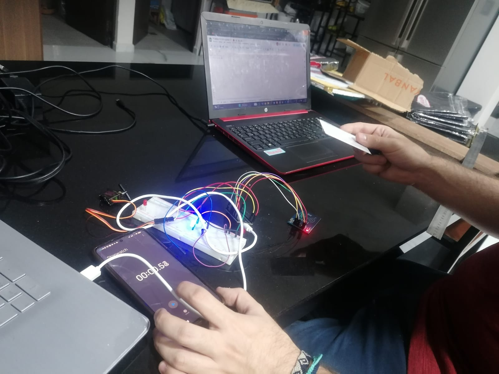
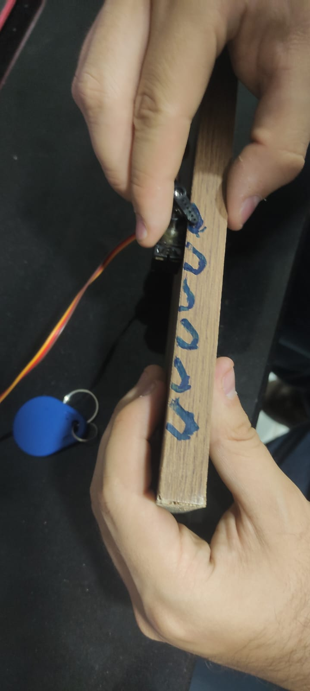
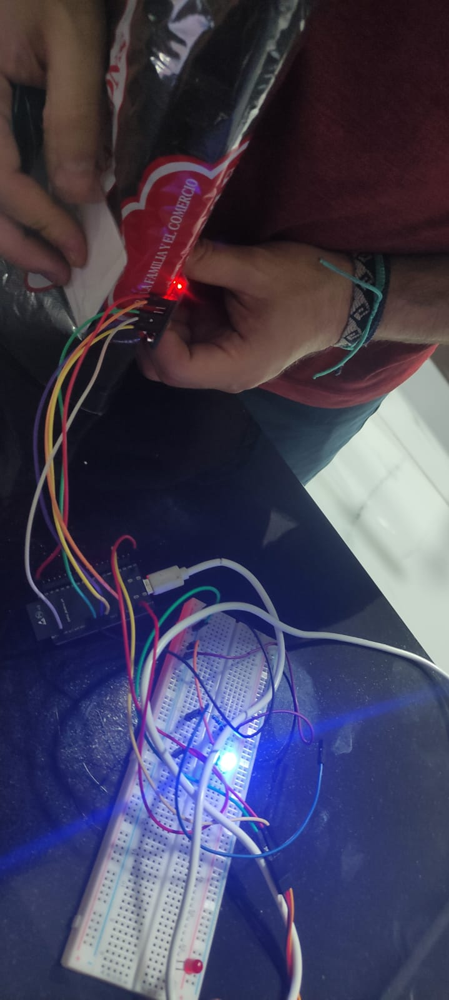
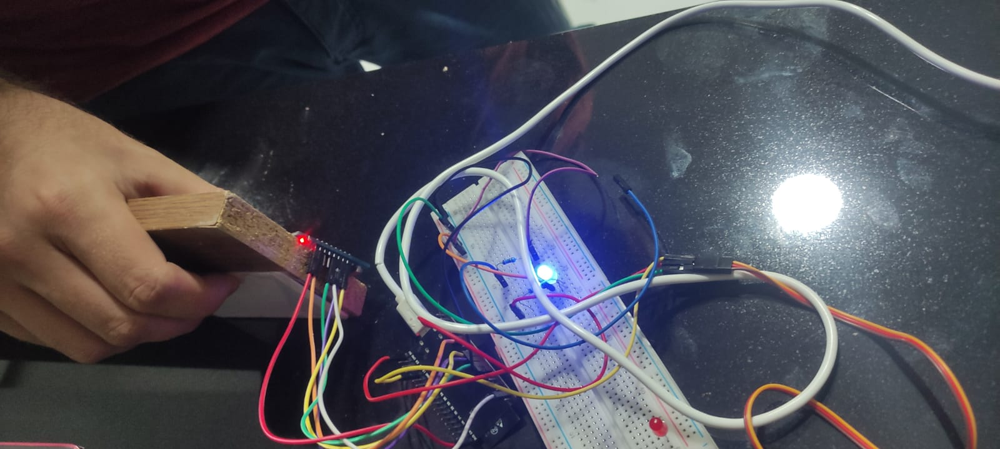

# Universidad Católica Boliviana Cochabamba
## Departamento de Ingeniería y Ciencias Exactas
## [SIS-234] Internet De Las Cosas
### Carrera de Ingeniería de Sistemas

---

# Informe sobre:
## Integración de un objeto inteligente con Alexa mediante MQTT y AWS.

### Evaluación de la Materia Internet de las Cosas

**Autores:**

- Vargas Prado Ariana Nicole  
- Zubieta Sempertegui Andres Ignacio  

---

Cochabamba - Bolivia  
Mayo 2026 

# 1. Requerimientos Funcionales y No Funcionales
## Requerimientos Funcionales

- El sistema debe permitir la lectura de tarjetas mediante un sensor RFID-RC522.

- El sistema debe identificar y diferenciar cada tarjeta RFID registrada.
- El sistema debe enviar el ID de la tarjeta leída hacia AWS IoT Core mediante MQTT.
- El sistema debe actualizar el estado reportado del dispositivo en el Shadow de AWS IoT Core.
- El sistema debe recibir comandos desde AWS IoT Core a través del Device Shadow desde Alexa y IoT core, los comandos se dividen en: 
    #### Comandos de acción del sistema:
   - Abrir puerta (SetModeOpen)
   - Cerrar puerta (SetModeClose)
   - Automatizar la puerta (SedModeAuto)
   - Cambiar temporizador de puerta (SetAutoTimer)
   - Registrar un RFID autorizado (SetCurrentTag)
   - Quitar un RFID registrado (RemoveCurrentTag)
    #### Comandos para recibir informacióm del sistema: 
   - Obtener estado del motor (GetMotorState) 
   - Obtener nombre del tag si esta presente (GetIfPresentTag) 
   - Obtener el tiempo de la ultima vez que se abrió la puerta (GetLastOpenTime) 
   - Obtener el ultimo tag registrado (GetLastTag) 
   - Obtener el estado de la puerta (GetDoorState)

- El sistema debe controlar el servomotor MG90S en función de los comandos anteriormente mencionados. 
- El sistema debe permitir el movimiento del servomotor cuando una tarjeta autorizada sea detectada.
- El sistema debe negar el acceso cuando una tarjeta no autorizada sea detectada.
El sistema debe permitir el control del servomotor mediante comandos a través de Alexa.
El sistema debe permitir que Alexa registre y mande las siguientes categorías:
   - Estado de la puerta: si está abierta o cerrada
   - Estado del motor: si está en movimiento o si está parado 
   - Información del sensor: si percibió algo, en qué momento percibió la mascota, que mascota percibió
   - nombre de la mascota

## Requerimientos No Funcionales

- El sistema debe garantizar una comunicación segura con AWS IoT Core (uso de certificados y TLS).
- El sistema debe tener una latencia de respuesta menor a 5 segundos entre comando y acción.
- El sistema debe ser escalable para integrar más sensores o actuadores en el futuro.
- El sistema debe ser modular, permitiendo separar lógica de hardware, red y control.
- El sistema debe manejar errores de conexión (reintentos automáticos a AWS).
- El sistema debe ser compatible con redes WiFi estándar (802.11 b/g/n).
- El sistema debe registrar logs básicos para depuración y monitoreo.
- El sistema debe ser fácil de usar mediante comandos simples en Alexa.

# 2. Diseño del Sistema

## 2.1 Diagrama de circuito

## 2.2 Diagrama de arquitectura del sistema

## 2.3 Diagramas estructurales y de comportamiento
### 2.3.1 Diagrama de secuencia

# 3. Implementación

## 3.1 Código fuente documentado

[Enlace a GitHub] https://github.com/Andrezubi/IoT-4to-Entregable

# 4. Pruebas y Validaciones

## 4.1 Prueba de exactitud de distancia

Para evaluar la exactitud del sensor RFID-RC522 se realizaron 16 mediciones de distancia máxima de detección, acercando lentamente la tarjeta RFID hasta identificar el punto límite en el que el sensor lograba reconocerla correctamente.

Los resultados obtenidos muestran que el sensor mantiene una distancia de detección estable y consistente, con valores que oscilan principalmente entre 3.2 cm y 3.7 cm. Se registró un único valor atípico de 6.5 cm, el cual se considera una medición aislada probablemente ocasionada por variaciones en la orientación de la tarjeta o interferencias externas.

A partir de los datos registrados se obtuvo:

- Distancia promedio de detección: **3.68 cm**
- Distancia mínima registrada: **3.2 cm**
- Distancia máxima registrada: **6.5 cm**
- Rango frecuente de funcionamiento: **3.3 cm a 3.7 cm**

## 4.2 Prueba de interferencia según distintos materiales

Para analizar el comportamiento del sensor RFID-RC522 frente a distintos materiales, se realizaron pruebas colocando diferentes superficies entre la tarjeta RFID y el sensor, manteniendo una distancia aproximada de entre 1 cm y 3 cm.

Los materiales utilizados fueron:

- Cartón de 1.2 cm de grosor.
- Plastoformo de 1.4 cm de grosor.
- Vidrio de 0.5 cm de grosor.
- Madera de 1.5 cm de grosor.
- Tela de 3.4 cm de grosor.
- Plástico de 3.3 cm de grosor.
- Aluminio de 0.5 cm de grosor.

Durante las pruebas se realizaron 10 mediciones por material para determinar si el sensor lograba detectar correctamente la tarjeta y si existía reducción en la distancia útil de lectura.

Resultados obtenidos:

- **Cartón:** detección exitosa en el 100% de las pruebas, sin reducción apreciable de distancia.
- **Plastoformo:** detección exitosa en el 100% de las pruebas, aunque se observó una disminución moderada de la distancia útil.
- **Vidrio:** detección exitosa en el 100% de las pruebas, pero con interferencia considerable en la estabilidad de lectura.
- **Madera:** detección exitosa en el 100% de las pruebas, con ligera reducción de distancia.
- **Tela:** detección exitosa en el 100% de las pruebas, sin efectos relevantes.
- **Plástico:** detección exitosa en el 100% de las pruebas, sin efectos significativos.
- **Aluminio:** el sensor no logró detectar la tarjeta en ninguna prueba, presentando además fallos temporales de lectura posteriores a la interferencia.

Los resultados muestran que los materiales no metálicos afectan mínimamente el funcionamiento del sensor, mientras que el aluminio genera una interferencia total debido a las propiedades electromagnéticas del material.

## 4.3 Prueba de tiempo de respuesta del sensor

Para evaluar el tiempo de respuesta del sensor RFID-RC522 se realizaron mediciones relacionadas con:

- Tiempo de reconocimiento de la tarjeta.
- Tiempo que tarda el sensor en dejar de detectar la tarjeta luego de alejarla.

Durante las pruebas se observó que el tiempo de lectura fue prácticamente instantáneo, por lo que no pudo medirse manualmente con precisión utilizando cronómetro.

En cambio, sí se logró medir el tiempo de “olvido” del sensor, obteniéndose los siguientes resultados:

- Tiempo promedio de olvido: **1.57 segundos**
- Tiempo mínimo registrado: **1.33 segundos**
- Tiempo máximo registrado: **1.86 segundos**
- Desviación estándar: **0.14 segundos**

Estos resultados muestran que el sensor posee una detección rápida y estable, manteniendo temporalmente el último estado detectado antes de reiniciarse.

## 4.4 Prueba de lectura continua

Se realizó una prueba de funcionamiento continuo dejando una tarjeta RFID sobre el sensor durante periodos prolongados de tiempo para verificar si existían pérdidas de conexión o fallos de lectura.

Las pruebas se realizaron desde 1 minuto hasta 10 minutos continuos.

Resultados obtenidos:

- El sensor mantuvo la detección activa durante todo el tiempo de prueba.
- No se presentaron pérdidas de conectividad.
- No se detectaron reinicios ni desconexiones del sistema.
- La estabilidad fue del 100% durante los 10 minutos evaluados.

## 4.5 Prueba de interferencia entre tarjetas

Se realizó una prueba utilizando dos tarjetas RFID simultáneamente con el objetivo de determinar el comportamiento del sensor al detectar múltiples identificadores cercanos.

Resultados obtenidos:

- El sensor logró detectar ambas tarjetas.
- El sistema alternaba continuamente entre los IDs detectados.
- El cambio de identificación ocurría de forma rápida y constante mientras ambas tarjetas permanecían cerca del sensor.
- Cuando las tarjetas fueron colocadas perpendicularmente al sensor, ninguna pudo ser detectada.

Esto demuestra que el sensor RFID-RC522 no está diseñado para manejar múltiples tarjetas simultáneamente en espacios reducidos, ya que se producen conflictos de lectura.

## 4.6 Pruebas de tiempo de reacción del servomotor

Se realizaron pruebas para medir el tiempo requerido por el servomotor MG90S para realizar movimientos de 90°.

Se ejecutaron 10 mediciones consecutivas obteniendo los siguientes resultados:

- Tiempo promedio de giro de 90°: **1754.6 ms**
- Tiempo mínimo registrado: **1746 ms**
- Tiempo máximo registrado: **1759 ms**

Los resultados muestran que el servomotor presenta un comportamiento estable y consistente en todos los movimientos realizados.

## 4.7 Prueba de precisión del servomotor

Para evaluar la precisión del servomotor se realizaron mediciones físicas de posición en ángulos de 0° y 180°.

Resultados obtenidos:

### Medición en 0°

- Promedio: **1.02**
- Desviación estándar: **0.079**

### Medición en 180°

- Promedio: **1.18**
- Desviación estándar: **0.063**

Los resultados muestran una baja variación entre mediciones, indicando que el servomotor mantiene una posición estable y repetible.

## 4.8 Prueba de funcionamiento continuo del servomotor

Se realizó una prueba de funcionamiento continuo del servomotor durante periodos prolongados para evaluar posibles problemas de calentamiento o pérdida de velocidad.

Resultados obtenidos:

- El servomotor funcionó correctamente durante los 9 minutos de prueba.
- No se detectó calentamiento significativo.
- No se observó disminución de velocidad.
- El sistema mantuvo estabilidad mecánica durante toda la prueba.

## 4.9 Prueba de obstrucciones del servomotor

Se realizaron pruebas colocando distintos objetos como obstrucción física al movimiento del servomotor.

Materiales utilizados:

- Dedos
- Madera
- Plastoformo
- Vidrio
- Metal
- Cartón

Resultados obtenidos:

- El servomotor logró recuperar rápidamente su posición después de la mayoría de interferencias.
- Las obstrucciones más rígidas, como metal y vidrio, lograron detener temporalmente el movimiento.
- Materiales ligeros como cartón y plastoformo no impidieron el funcionamiento normal del motor.

Esto demuestra que el sistema posee una capacidad aceptable de recuperación ante pequeñas obstrucciones mecánicas.

# 5. Resultados

## 5.1 Resultados de integración del sistema distribuido

El sistema implementado logró integrar correctamente los módulos ESP32, el sensor RFID-RC522, el servomotor MG90S, AWS IoT Core, MQTT y Alexa mediante comunicación WiFi.

Se verificó el correcto funcionamiento de:

- Lectura de tarjetas RFID.
- Envío de información mediante MQTT hacia AWS IoT Core.
- Actualización del Device Shadow.
- Recepción de comandos desde Alexa.
- Control remoto y automático del servomotor.

El sistema respondió correctamente a los comandos de apertura, cierre y automatización de la "puerta", demostrando una integración funcional entre hardware, nube y asistentes virtuales.

## 5.2 Resultados de exactitud de distancia

Los resultados muestran que el sensor RFID-RC522 posee una distancia de lectura efectiva promedio de aproximadamente **3.68 cm**, manteniendo un comportamiento estable en la mayoría de pruebas realizadas.

La mayoría de mediciones se concentraron entre **3.3 cm y 3.7 cm**, lo que evidencia un funcionamiento consistente y preciso para aplicaciones de acceso cercano.

Esto cumple correctamente con el requerimiento funcional relacionado con la lectura de tarjetas RFID.

## 5.3 Resultados de interferencia según materiales

Las pruebas realizadas demostraron que los materiales no metálicos afectan mínimamente el funcionamiento del sensor RFID.

Materiales como cartón, tela y plástico mantuvieron una tasa de detección del 100%, mientras que el aluminio bloqueó completamente la comunicación RFID debido a sus propiedades conductoras.

Esto permitió identificar las limitaciones físicas del sistema y definir recomendaciones para futuras instalaciones.

## 5.4 Resultados de tiempo de respuesta del sensor

El sensor RFID-RC522 presentó tiempos de lectura prácticamente instantáneos cuando la tarjeta se encontraba dentro del rango operativo.

El tiempo promedio para dejar de detectar una tarjeta fue de aproximadamente **1.57 segundos**, mostrando una respuesta estable y repetible.

La baja desviación estándar obtenida evidencia consistencia en el comportamiento del sensor.

## 5.5 Resultados de lectura continua

Durante las pruebas de lectura continua el sistema mantuvo estabilidad total durante periodos de hasta 10 minutos sin presentar pérdidas de detección ni desconexiones.

Esto demuestra que el sistema puede operar de manera continua y confiable durante largos periodos de funcionamiento.

## 5.6 Resultados de interferencia entre tarjetas

Las pruebas demostraron que el sensor puede detectar múltiples tarjetas cercanas, aunque no de forma simultánea estable.

Cuando dos tarjetas se encontraban próximas al sensor, el sistema alternaba constantemente entre ambos identificadores, generando inestabilidad en la lectura.

Además, la orientación de las tarjetas influye significativamente en la detección.

## 5.7 Resultados de tiempo de reacción del servomotor

El servomotor MG90S presentó tiempos de reacción consistentes, con un promedio de **1754.6 ms** para movimientos de 90°.

La baja variación entre pruebas demuestra estabilidad mecánica y precisión en los movimientos ejecutados.

## 5.8 Resultados de precisión del servomotor

Las pruebas de precisión evidenciaron una variación mínima entre posiciones repetidas, obteniendo desviaciones estándar menores a 0.08 en todas las mediciones realizadas.

Esto demuestra que el servomotor mantiene posiciones estables y repetibles, adecuadas para el sistema de apertura de puerta implementado.

## 5.9 Resultados de funcionamiento continuo del servomotor

El servomotor funcionó correctamente durante periodos prolongados sin presentar sobrecalentamiento ni pérdida de velocidad.

El sistema mantuvo estabilidad mecánica y eléctrica durante toda la prueba continua realizada.

## 5.10 Resultados de pruebas de obstrucción del servomotor

El servomotor logró recuperarse correctamente ante la mayoría de obstrucciones mecánicas evaluadas.

Los materiales más rígidos consiguieron detener temporalmente el motor, mientras que materiales ligeros no afectaron significativamente el movimiento.

Esto demuestra una adecuada capacidad de recuperación del sistema ante pequeñas interferencias físicas.

# 6. Conclusiones

1. El sistema logró integrar exitosamente el sensor RFID-RC522, el servomotor MG90S, AWS IoT Core, MQTT y Alexa, permitiendo controlar la apertura y cierre de la puerta tanto de manera automática como mediante comandos de voz. Esto demuestra el correcto funcionamiento de la arquitectura IoT implementada.

2. Las pruebas de exactitud mostraron que el sensor RFID-RC522 posee una distancia efectiva promedio de lectura de **3.68 cm**, manteniendo la mayoría de mediciones entre **3.3 cm y 3.7 cm**, lo que evidencia un comportamiento estable y adecuado para aplicaciones de control de acceso de corto alcance.

3. El sensor presentó tiempos de respuesta muy rápidos, ya que la detección de tarjetas fue prácticamente inmediata dentro del rango operativo. Además, el tiempo promedio de “olvido” registrado fue de **1.57 segundos**, con una desviación estándar de apenas **0.14 segundos**, indicando consistencia en el funcionamiento.

4. Las pruebas de interferencia demostraron que materiales no metálicos como cartón, tela y plástico permiten una detección correcta en el **100% de las pruebas realizadas**, mientras que el aluminio bloqueó completamente la comunicación RFID, evidenciando la sensibilidad del sistema frente a materiales conductores.

5. El servomotor MG90S mostró un comportamiento estable y preciso, obteniendo un tiempo promedio de **1754.6 ms** para movimientos de 90°, además de mantener funcionamiento continuo durante varios minutos sin sobrecalentamiento ni pérdida de velocidad, confirmando su confiabilidad para aplicaciones automatizadas.

---

# 7. Recomendaciones

1. Evitar el uso de materiales metálicos, especialmente aluminio, cerca del sensor RFID-RC522, ya que durante las pruebas este material provocó una tasa de detección del **0%** y generó interferencias temporales en el funcionamiento del sistema.

2. Implementar mecanismos de filtrado o validación de lectura para evitar conflictos cuando múltiples tarjetas RFID se encuentren cerca del sensor, debido a que el sistema alterna rápidamente entre identificadores y genera lecturas inestables.

3. Incorporar una fuente de alimentación externa y regulada para el servomotor MG90S en futuras versiones del proyecto, con el objetivo de garantizar mayor estabilidad eléctrica y reducir posibles caídas de tensión durante movimientos continuos.

4. Añadir sensores complementarios, como sensores ultrasónicos o infrarrojos, para mejorar la automatización del sistema y aumentar la seguridad en la detección de presencia o movimiento cerca de la puerta.

5. Realizar pruebas de funcionamiento continuo durante periodos más prolongados y bajo distintas condiciones ambientales, con el fin de evaluar el comportamiento del sistema frente a variaciones de temperatura, humedad y uso intensivo a largo plazo.

# 8. Anexos 

[Enlace a la planilla de pruebas](https://docs.google.com/spreadsheets/d/1vf-1s-AhRqPHOushzfqOPbe9ObheVhk6w0d8jkjzZqQ/edit?gid=0#gid=0) 

### Imagenes de las pruebas

